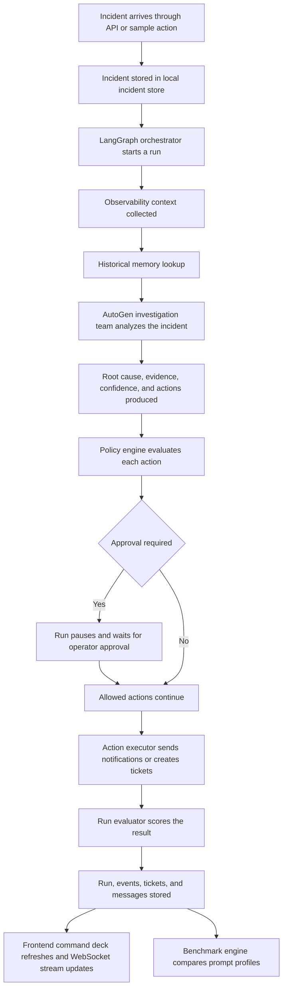
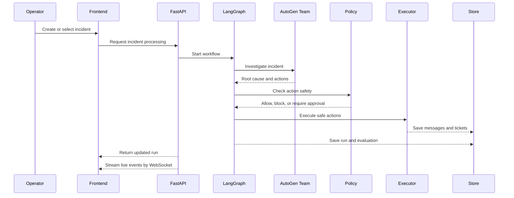

# AI Incident Commander

AI Incident Commander is a real time DevOps incident response platform built to show how modern agentic AI systems can support operations teams during live service failures.

The project combines LangGraph for workflow orchestration, AutoGen for investigation logic, FastAPI for the backend, and Next.js for a live operator console. It is designed as a strong portfolio project that demonstrates incident triage, root cause analysis, policy driven remediation, human approval, benchmarking, evaluation, and replayable runs.

## Why this project exists

When production incidents happen, engineers usually move through the same sequence again and again. They read the alert, inspect metrics, scan logs, compare with older incidents, decide whether a remediation is safe, notify the right people, and later write down what happened.

This project turns that process into an AI assisted workflow.

Instead of acting like a chatbot, the system behaves like an AI incident commander. It receives an incident, enriches it with observability context, investigates likely causes, proposes actions, applies policy checks, waits for approval when risk is high, executes safe actions, and records the full run for later review.

## What the platform does

1. Accepts incidents from the API or from built in sample payloads.
2. Enriches incidents with observability signals and historical memory.
3. Runs an investigation workflow using LangGraph and AutoGen.
4. Produces a suspected root cause, supporting evidence, confidence score, and recommended actions.
5. Applies a policy engine to decide whether actions are safe, blocked, or require approval.
6. Executes allowed actions through the action executor.
7. Stores runs, events, tickets, messages, and benchmark summaries.
8. Streams the latest run activity to the frontend through WebSockets.
9. Benchmarks multiple prompt profiles and compares their performance.

## Real world value

In a real DevOps or SRE setting, this kind of system can help reduce mean time to resolution, standardize incident handling, and lower the amount of manual triage work required from engineers.

It is especially useful for scenarios such as:

1. latency spikes after heavy traffic
2. error rate increases after a deployment
3. recurring incidents that look similar to known failures
4. situations where operators need approval gated automation instead of blind execution

## Core architecture

The platform uses each framework for a specific job.

1. LangGraph acts as the outer orchestration layer.
2. AutoGen acts as the investigation layer.
3. FastAPI exposes the backend APIs and WebSocket stream.
4. Next.js provides the operator console.
5. Local JSON storage keeps the project easy to run and demo.

## Project flow



## High level workflow



## Tech stack

### Backend

1. FastAPI
2. Pydantic
3. LangGraph
4. AutoGen
5. Local JSON persistence

### Frontend

1. Next.js App Router
2. TypeScript
3. Framer Motion
4. Recharts
5. Custom CSS design system

## Current implementation

The current version is a strong local prototype and demo platform.

### Implemented now

1. Incident creation and listing
2. LangGraph based orchestration with fallback support
3. AutoGen investigation adapter with heuristic local fallback
4. Policy based action gating
5. Human approval flow
6. Action execution layer
7. Replayable event stream
8. Prompt profile benchmarking
9. Evaluation summaries
10. Professional Next.js operator dashboard

### Mocked for local development

1. Observability integrations
2. Ticketing integration
3. Chat notifications
4. Production remediation systems

This choice keeps the project easy to run while still showing the full product design clearly.

## Repository structure

```text
autogen/
  app/
    core/
    integrations/
    services/
    workflow/
    config.py
    main.py
    models.py
  data/
  frontend/
    src/
    next.config.ts
    package.json
  tests/
  .env.example
  requirements.txt
  README.md
```

## Backend entry points

The main backend entrypoint is `app/main.py`.

Important modules:

1. `app/main.py`
   Starts the FastAPI app and wires the service container.

2. `app/workflow/langgraph_orchestrator.py`
   Runs the orchestration flow for investigation, policy checks, execution, and finalization.

3. `app/workflow/autogen_team.py`
   Produces the investigation result with root cause, evidence, confidence, and actions.

4. `app/services/incident_service.py`
   Handles the application service layer across incidents, runs, approvals, and benchmarks.

5. `app/core/`
   Contains memory, policy, evaluation, benchmark, profiles, storage, and sample data modules.

## Frontend experience

The frontend is intentionally designed as a command deck rather than a generic admin page.

The console includes:

1. an incident queue
2. an active investigation panel
3. a replay rail for live events
4. benchmarking charts
5. severity analytics
6. ticket and alert output
7. profile and scoring panels

The main frontend view lives in `frontend/src/components/incident-console.tsx`.

## API endpoints

### Health and metadata

1. `GET /health`
2. `GET /profiles`

### Incident operations

1. `GET /incidents`
2. `POST /incidents`
3. `POST /incidents/sample`
4. `GET /incidents/{incident_id}`
5. `POST /incidents/{incident_id}/process`
6. `POST /incidents/{incident_id}/approval`

### Run and replay operations

1. `GET /runs`
2. `GET /runs/{run_id}`
3. `GET /runs/{run_id}/replay`
4. `WS /ws/incidents/{incident_id}`

### Output and benchmark operations

1. `GET /tickets`
2. `GET /messages`
3. `POST /benchmarks/run`
4. `GET /benchmarks/history`
5. `GET /benchmarks/sample`
6. `POST /benchmarks/sample/run`

## Local setup

### Backend

1. Create and activate your Python environment.
2. Install dependencies.

```bash
python -m pip install -r requirements.txt
```

3. Copy `.env.example` to `.env`.
4. Add your `OPENAI_API_KEY` if you want the real model backed path enabled.
5. Start the backend.

```bash
uvicorn app.main:app --reload
```

### Frontend

1. Move into the frontend folder.

```bash
cd frontend
```

2. Install frontend dependencies.

```bash
npm install
```

3. Start the frontend.

```bash
npm run dev
```

4. Open the local URL printed by Next.js.

## How to demo the project

1. Start the backend.
2. Start the frontend.
3. Open the command deck.
4. Click `New sample` or `Inject and investigate`.
5. Watch the queue, investigation panel, replay rail, and output panels update.
6. Run the sample benchmark to populate the profile comparison chart.

## Why LangGraph and AutoGen are both used

This project uses both frameworks intentionally instead of mixing them without a reason.

LangGraph is responsible for durable workflow structure. It controls the stages of the incident run, including investigation, policy checks, execution, and pause or resume behavior around approvals.

AutoGen is responsible for the investigation layer. It produces the reasoning oriented output such as suspected root cause, evidence, confidence, and recommended actions.

In short:

1. LangGraph controls the flow.
2. AutoGen performs the investigation logic inside the flow.

## Future improvements

The next natural upgrades for this project are:

1. real Grafana and Prometheus ingestion
2. real Slack and Jira integrations
3. real Kubernetes or cloud safe action adapters
4. stronger memory over past incidents
5. deeper benchmark datasets
6. authentication and role based access
