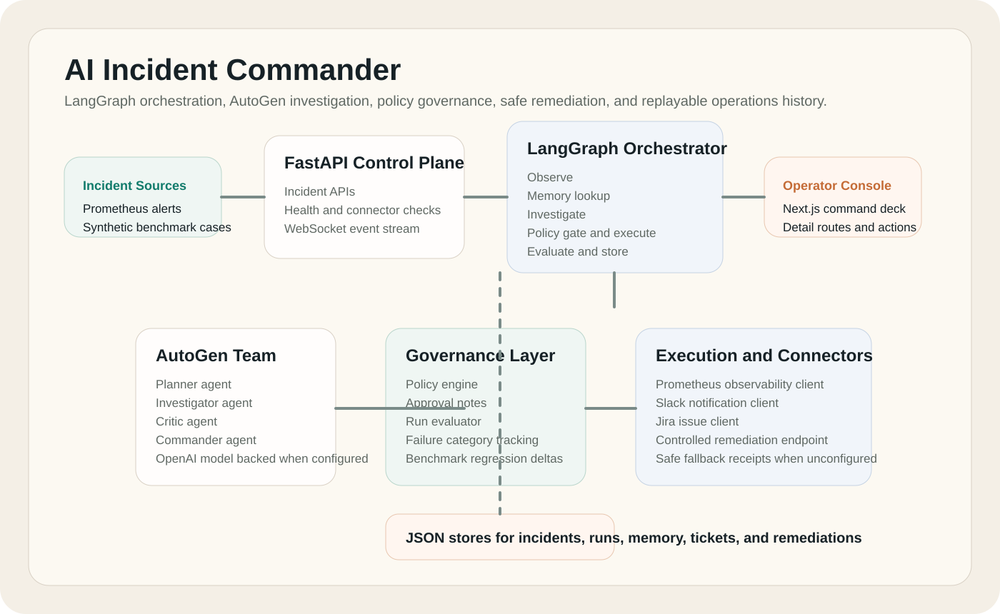
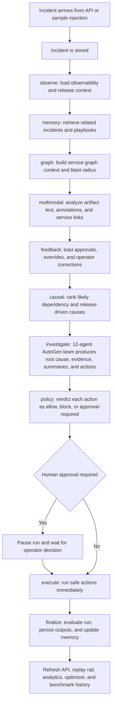
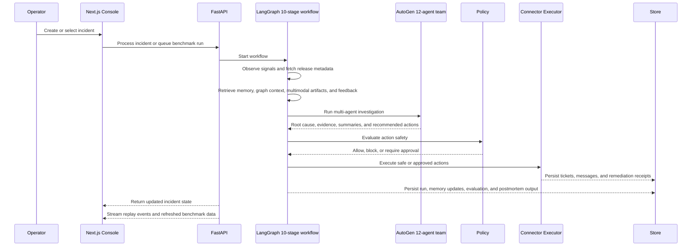
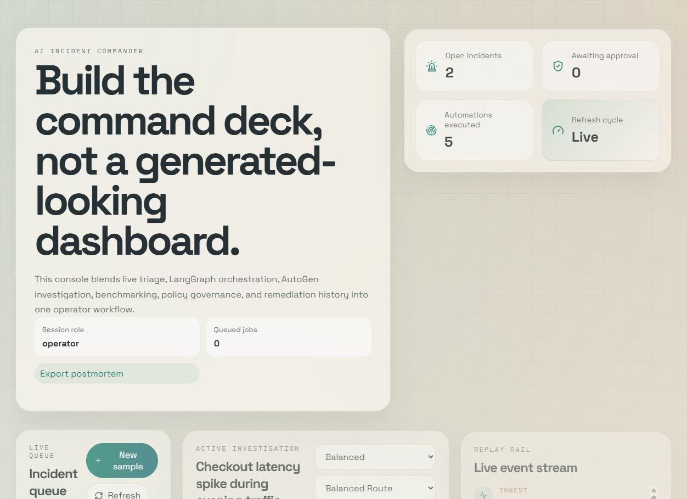
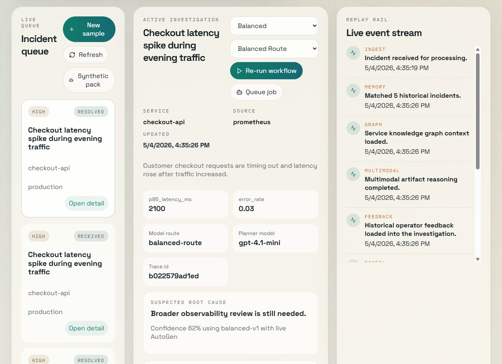
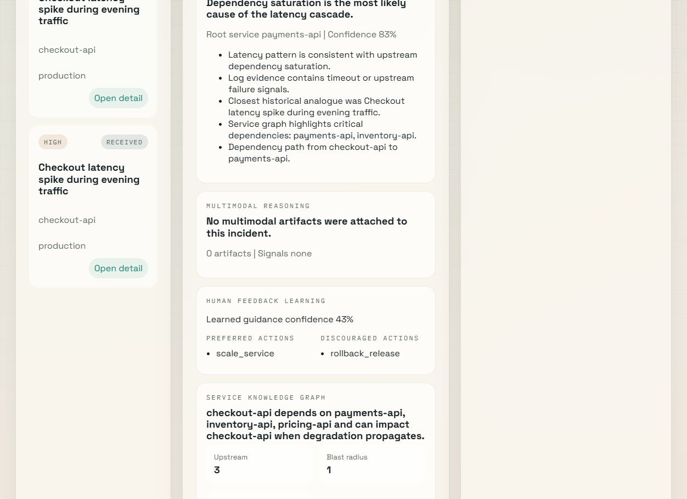

# AI Incident Commander

[](https://github.com/Theepankumargandhi/Ai-incident-commander-langgraph-autogen/actions/workflows/ci.yml)

AI Incident Commander is a real time DevOps incident response platform that shows how agentic AI can support operators during live service failures.

The project combines LangGraph for workflow orchestration, AutoGen for multi agent investigation, FastAPI for the backend control plane, and Next.js for a command center style operator console. It is built to feel like a real internal platform rather than a chatbot demo.

The current architecture uses a `12 agent AutoGen investigation team` inside a `10 stage LangGraph workflow`, which makes the system feel much closer to an internal incident intelligence platform than a simple agent demo.

## The Problem

During an active incident, engineers often spend the first `15 to 20 minutes` just gathering context across dashboards, logs, release history, runbooks, and past tickets before they can decide on a safe first action. That delay is expensive because the service is already degraded while the human operator is still assembling the story.

AI Incident Commander compresses that context-gathering phase into a structured AI-assisted triage workflow. Instead of forcing an engineer to hunt through disconnected tools, the platform assembles evidence, ranks likely causes, proposes controlled remediations, and makes approval boundaries explicit in one place.

## What Is Implemented Now

The current version is a strong end to end platform prototype with real connector paths and safe fallbacks.

### Live capabilities already in place

1. FastAPI incident API and WebSocket replay stream
2. LangGraph style orchestration with observability, memory, graph, multimodal, feedback, causal, investigation, policy, execution, and evaluation stages
3. AutoGen multi agent runtime with route specific planner, investigator, critic, and commander model selection
4. Extended AutoGen collaboration with runbook, release correlation, causal, graph, artifact, feedback, remediation review, and postmortem writing roles
5. Background job execution for incident processing and benchmark packs
6. Postgres backed persistence with automatic fallback to JSON stores for local demo mode
7. Normalized Postgres projections for incidents, runs, actions, policy decisions, benchmarks, memory, and remediation receipts
8. Prompt profile benchmarking with score, confidence, judge score, and regression tracking across model routes
9. Historical incident memory with weighted retrieval over symptoms, metrics, prior remediation quality, abstract lessons, and service playbooks
10. LLM as a judge scoring with heuristic fallback for root cause quality, evidence sufficiency, action safety, explanation quality, and postmortem usefulness
11. Rule based reflection and correction that revises risky or weak recommendations before finalization
12. Synthetic incident generation for noisy, incomplete, false positive, and hard benchmark scenarios
13. Causal root cause reasoning over service dependencies, propagation paths, and release correlation
14. Adversarial incident simulation lab for noisy, conflicting, and cascading-failure benchmark scenarios
15. Self-improving optimizer that recommends better profiles, model routes, memory strategy, and prompt adjustments from benchmark history
16. Run comparison, failure taxonomy analytics, root cause trends, and Markdown postmortem export
17. Bearer token based viewer, operator, and remediation access controls
18. Structured logging plus OpenTelemetry tracing wired for AWS X-Ray export through an OTLP collector
19. GitHub release correlation support for staging and deployment context
20. Controlled remediation gateway with action allowlists, environment guards, and auditable receipts
21. Next.js operator console with role aware actions, model route selection, queued jobs, run comparison, approval notes, remediation history, judge output, audience summaries, adversarial lab execution, optimizer guidance, feedback learning, and graph context
22. Dockerfiles and docker compose support for local deployment
23. Artifact-guided multimodal reasoning over attached Grafana screenshots, architecture diagrams, and trace artifacts using their titles, descriptions, extracted text, annotations, and related service links
24. Human feedback learning that folds approvals, overrides, and corrections back into future investigations
25. A service knowledge graph that feeds blast radius, dependency paths, and graph-backed causal reasoning
26. Isolation Forest anomaly detection over Prometheus metric history before the workflow hands evidence to AutoGen
27. RAG-backed runbook retrieval that indexes Markdown or text procedures, embeds them, and cites matching snippets before AutoGen begins
28. DORA and SRE reliability analytics with MTTR, change failure, deployment frequency, automation, latency, cost, and blocked-action metrics

### Real connectors with safe fallback behavior

1. Prometheus can be used as a real observability source. If it is not configured, the platform falls back to local synthetic observability snapshots.
2. Slack can send real notifications through `chat.postMessage`. If it is not configured, messages are still recorded locally for replay and demo purposes.
3. Jira can create real issues through the Jira Cloud REST API. If it is not configured, ticket records are still stored locally.
4. Controlled remediation can call a real internal HTTP endpoint. If it is not configured, the run still records a remediation receipt instead of silently failing.
5. AutoGen can run a real model backed multi agent investigation. If model access is unavailable, the platform falls back to a deterministic local investigation path.

## Benchmark Results

The table below was captured on `May 5, 2026` by running the built-in five-case sample benchmark pack across the three default prompt profiles. This particular capture was taken in local demo mode, so the platform used its implemented heuristic judge fallback and offline embedding fallback instead of hosted model calls.

| Profile | Cases | Root Cause Quality | Action Safety Score | Avg Confidence | Judge Score | Root Cause Match Rate |
| --- | --- | --- | --- | --- | --- | --- |
| `balanced-v1` | 5 | 81.60 | 78.40 | 0.796 | 94.60 | 1.00 |
| `conservative-v1` | 5 | 71.40 | 72.00 | 0.732 | 87.00 | 1.00 |
| `aggressive-v1` | 5 | 81.60 | 78.40 | 0.872 | 94.60 | 1.00 |

`Root Cause Quality` and `Action Safety Score` are averaged from the per-run evaluation sub-scores. `Judge Score` is the evaluator's judge value, which falls back to the implemented heuristic judge when the hosted judge model is unavailable.

## Architecture







## Product Screenshots

### Command deck overview



### Active investigation and replay stream



### GenAI reasoning layers



### Core responsibilities

1. `LangGraph` owns the outer workflow.
2. `AutoGen` owns the investigation team inside that workflow.
3. `FastAPI` exposes the API, health checks, and event stream.
4. `Next.js` gives operators a live command deck.
5. The storage layer can run on Postgres and fall back to JSON for local demo mode.

### Advanced platform features

The current codebase also includes these higher weightage engineering layers:

1. background workers for asynchronous incident and benchmark execution
2. normalized relational projections on top of the Postgres payload store
3. OpenTelemetry tracing with per-stage and per-agent spans, carrying `incident_id` and `run_id`, and designed to flow into AWS X-Ray through the in-cluster ADOT collector
4. model routing so different agent roles can use different models
5. weighted historical memory retrieval and search
6. automatic postmortem generation and Markdown export
7. role aware operator workflows in the frontend
8. replay comparison between runs for the same incident
9. analytics for recurring root causes, failure taxonomy, and benchmark performance
10. release correlation from GitHub Actions metadata for staging aware investigations
11. explanation bundles for operator, executive, engineering, and postmortem audiences
12. synthetic incident generation for benchmark hardening
13. causal reasoning over service dependency graphs before the main multi-agent investigation begins
14. adversarial simulation and optimizer loops that turn benchmark history into system improvement recommendations
15. artifact-guided multimodal reasoning over screenshot descriptions, extracted annotations, architecture notes, and trace text
16. operator feedback learning that changes future guidance, preferred actions, and discouraged actions
17. service graph reasoning that enriches causal analysis with blast radius and dependency paths
18. RAG runbook retrieval with service and environment filters, embedding fallback, and persisted citations in the incident context
19. DORA/SRE scorecard analytics exposed through the API and rendered in the command deck

## Investigation Stack

### Agent Justification

1. `PlannerAgent` breaks the incident into a clean investigation plan and decides which evidence streams should speak first. It should stay separate from final synthesis because planning too early around a preferred answer makes the rest of the team less useful.
2. `InvestigatorAgent` gathers observability, historical memory, and policy context through tools before the team makes claims. It should not be merged with the runbook or commander roles because raw evidence collection needs a stricter, source-first prompt than summary writing.
3. `RunbookAgent` extracts reusable remediation patterns, service playbook hints, and lessons from prior incidents. It should stay separate from `InvestigatorAgent` so historical guidance does not drown out what is unique about the current incident.
4. `ReleaseCorrelationAgent` isolates deployment and release metadata as its own hypothesis stream. It should not be merged into general investigation because release signals are often tempting but misleading, so they are safer when treated as a falsifiable specialist view.
5. `CausalAnalystAgent` reasons over propagation paths, likely root services, and dependency-driven failure chains. It needs to remain distinct from graph explanation because causal ranking is different from simply describing topology.
6. `VisualReasoningAgent` works on artifact metadata, extracted text, annotations, and related service links from screenshots, diagrams, and trace artifacts. It should stay separate from log and metric analysis because artifact interpretation uses a different evidence shape and different failure modes.
7. `GraphReasoningAgent` explains the service graph, blast radius, and upstream or downstream impact around the focal service. It should not be merged with `CausalAnalystAgent` because graph structure is stable context, while causal reasoning is a probabilistic conclusion built on top of that context.
8. `CriticAgent` pressure-tests the draft investigation for missing evidence, weak assumptions, and overconfident conclusions. It must remain separate from `CommanderAgent` so the final answer is challenged instead of self-approved.
9. `FeedbackLearningAgent` pulls prior approvals, overrides, and operator corrections into the current run. It should not be merged with the runbook layer because human feedback is normative guidance about how operators actually respond, not just generic historical procedure.
10. `RemediationReviewerAgent` scores action safety and separates reversible actions from risky ones. It stays separate from the general critic because remediation governance is a narrower, policy-shaped problem than broad investigation quality.
11. `PostmortemWriterAgent` prepares operator, executive, engineering, and postmortem-ready summaries from the same incident. It should not be merged with `CommanderAgent` because audience-specific communication deserves its own pass before the final structured payload is locked.
12. `CommanderAgent` turns the team’s work into the final structured investigation result, action set, explanation bundle, and JSON payload. It should stay at the end of the chain because synthesis is strongest when every specialist has already contributed and the critique loop has finished.

### LangGraph workflow stages

The outer workflow currently moves through:

1. observe
2. memory
3. graph
4. multimodal
5. feedback
6. causal
7. investigate
8. policy
9. execute
10. finalize

## The Real Time Value

In a real SRE or DevOps setting, this platform helps teams reduce manual triage and respond with more consistency.

Typical scenarios include:

1. checkout latency spikes
2. elevated error rates after a deployment
3. recurring incidents that match older postmortems
4. incidents where remediation must be policy gated before execution

The main value is not just analysis. The value is safe action.

The system helps teams move from manual firefighting to AI assisted triage, policy checked execution, and replayable incident history.

## Operator Experience

The frontend is designed as an incident command deck rather than a generic admin dashboard.

The main console includes:

1. a live incident queue
2. an active investigation panel
3. a replay rail for run events
4. benchmark comparison and regression history
5. model route selection and role aware operator actions
6. severity distribution analytics
7. tickets, notifications, and remediation receipts
8. memory abstractions, connector status, queued jobs, and evaluation context
9. postmortem export and previous run comparison
10. judge scoring, rule based reflection notes, and audience specific summaries
11. artifact-guided multimodal reasoning, feedback learning, and service graph context inside the investigation view

There is also a dedicated detail route at `/incidents/[incidentId]` so a single incident can be reviewed with full context.

## Connector Matrix

| Layer | Real path | Fallback path |
| --- | --- | --- |
| Storage | Postgres collections | Local JSON stores |
| Observability | Prometheus instant queries | Local synthetic metrics and logs |
| Notifications | Slack `chat.postMessage` | Stored message records |
| Ticketing | Jira issue creation | Stored ticket records |
| Remediation | Controlled gateway with allowlists and environment checks | Stored remediation receipts |
| Investigation | AutoGen plus OpenAI model | Deterministic heuristic investigation |

## Security And Access Model

The project includes lightweight role based bearer token checks for three access levels:

1. viewer
2. operator
3. remediation endpoint caller

This is intentionally simple so the repo stays easy to run locally.

For a true production deployment, you would usually place the backend behind:

1. a real identity provider
2. a server side session layer
3. a reverse proxy with proper user claims

The current token model is still useful for internal demos, Postman workflows, CI checks, and controlled local deployments.

## Health And Observability Endpoints

The backend exposes a few helpful operational endpoints:

1. `GET /health`
2. `GET /health/live`
3. `GET /health/ready`
4. `GET /health/connectors`

These make it easy to verify whether the service is alive, ready, and running in real mode or fallback mode for each connector.

## Runbook RAG Engine

The backend includes a lightweight RAG layer for operator runbooks. It can ingest Markdown and text files from `RUNBOOK_DIR`, generate embeddings with the configured OpenAI endpoint, and fall back to deterministic local embeddings when model access is unavailable.

Useful routes:

1. `POST /runbooks/ingest` indexes every `.md`, `.markdown`, and `.txt` file under `RUNBOOK_DIR`
2. `POST /runbooks` stores or updates one runbook document directly
3. `GET /runbooks` lists indexed documents
4. `GET /runbooks/search?query=latency&service=checkout-api` returns ranked snippets with source, score, service, and environment metadata

During incident processing, matching runbook snippets are written into `incident.context.runbook_hits` during the memory stage. The AutoGen runbook role reads those citations before the final recommendation is produced, so procedures and historical memory both inform the investigation.

## DORA And SRE Metrics

`GET /analytics/dora-sre` returns a reliability scorecard for the selected window. The dashboard computes DORA-style deployment frequency, change failure rate, failed deployment recovery time, and SRE operating indicators including MTTR, automation success, run success, blocked-action rate, p95 run latency, average run cost, and recurring service rate.

The frontend command deck renders this response in the DORA/SRE panel so operators can see delivery and reliability signals next to active incident workflow data.

## Webhook Integrations

The backend can ingest alert webhooks directly from PagerDuty and OpsGenie, convert them into first-class incidents, and immediately trigger the investigation workflow.

| Provider | Endpoint | Verification |
| --- | --- | --- |
| PagerDuty | `POST /webhooks/pagerduty` | HMAC SHA-256 signature in `x-pagerduty-signature` using `PAGERDUTY_WEBHOOK_SECRET` |
| OpsGenie | `POST /webhooks/opsgenie` | Static token in `x-opsgenie-webhook-secret` using `OPSGENIE_WEBHOOK_SECRET` |

PagerDuty v2 payloads are mapped from the first `messages[]` event. OpsGenie payloads are mapped from `alert`. In both cases the platform extracts title, severity, service, environment, metric hints, and alert details into `incident.context.alert_details`.

Set `OPSGENIE_WEBHOOK_SECRET_HEADER` if your OpsGenie integration sends the token under a different header name.

## Plugin Development Guide

The platform loads built-in plugins from `app/plugins/builtin/` and custom plugins from `PLUGIN_DIR`. Plugins implement one of the abstract base classes in `app/plugins/base.py`: `ObservabilityPlugin`, `NotificationPlugin`, `RemediationPlugin`, or `AgentPlugin`.

Loaded plugins are visible at `GET /plugins` with `name`, `type`, `version`, and `status`. Runtime lookup is available through `app.plugins.registry.get_plugin(type, name)`.

Minimal custom Datadog observability plugin:

```python
# $PLUGIN_DIR/datadog_plugin.py
import os
import httpx

from app.plugins.base import ObservabilityPlugin


class DatadogPlugin(ObservabilityPlugin):
    name = "datadog"
    version = "0.1.0"

    def __init__(self, settings=None):
        self.api_key = os.getenv("DATADOG_API_KEY", "")
        self.app_key = os.getenv("DATADOG_APP_KEY", "")
        self.base_url = os.getenv("DATADOG_API_BASE", "https://api.datadoghq.com")

    def collect_metrics(self, incident):
        query = f"avg:trace.http.request.duration{{service:{incident.service}}}"
        response = httpx.get(
            f"{self.base_url}/api/v1/query",
            params={"from": "now-5m", "to": "now", "query": query},
            headers={"DD-API-KEY": self.api_key, "DD-APPLICATION-KEY": self.app_key},
            timeout=5,
        )
        response.raise_for_status()
        points = response.json().get("series", [{}])[0].get("pointlist", [])
        latest = points[-1][1] if points else 0
        return {"p95_latency_ms": float(latest or 0)}

    def collect_logs(self, incident):
        return [f"Datadog metric query completed for {incident.service}"]
```

Set `PLUGIN_DIR=/path/to/plugins`, restart the backend, then check `GET /plugins` for `datadog`.

## Notable API Endpoints

Beyond the health routes, a few endpoints are especially useful during demos and evaluation:

1. `POST /incidents/{incident_id}/process` to run or queue an investigation
2. `POST /benchmarks/sample/run` to run or queue the sample benchmark pack
3. `GET /jobs` to inspect background work
4. `GET /analytics/summary` to review root cause and failure trends
5. `GET /runs/compare` to diff two runs for the same incident
6. `GET /runs/{run_id}/postmortem.md` to export a Markdown postmortem
7. `GET /memory/search` to query stored incident memory
8. `GET /model-routes` to inspect the available model routing strategies
9. `POST /synthetic/benchmark-cases` to generate harder benchmark cases
10. `POST /synthetic/incidents` to generate and optionally persist synthetic incidents
11. `POST /lab/adversarial/run` to execute the adversarial simulation and evaluation lab
12. `GET /optimizer/recommendation` to inspect the latest optimizer guidance from benchmark history
13. `POST /incidents/{incident_id}/artifacts` to attach multimodal incident artifacts
14. `GET /service-graph` to inspect the service dependency graph or a service scoped view
15. `GET /feedback/summary` to inspect learned operator guidance for a service
16. `POST /runs/{run_id}/feedback` to record corrections, overrides, and operator preferences
17. `POST /runbooks/ingest` to index runbook files from `RUNBOOK_DIR`
18. `GET /runbooks/search` to retrieve runbook snippets for an incident or service
19. `GET /analytics/dora-sre` to inspect DORA and SRE reliability metrics

## Repository Structure

```text
autogen/
  app/
    core/
    integrations/
    services/
    workflow/
    config.py
    main.py
    models.py
  data/
  docs/
    architecture/
    assets/
  frontend/
    src/
    Dockerfile
    next.config.ts
    package.json
  tests/
  .env.example
  Dockerfile
  docker-compose.yml
  requirements.txt
  README.md
```

## Environment Setup

### Backend environment

Copy `.env.example` to `.env` and fill in only the connectors you want to run live.

The most important values are:

1. `OPENAI_API_KEY` for real AutoGen investigation
2. `OPENAI_API_BASE`, `JUDGE_MODEL`, and `SYNTHETIC_GENERATION_MODEL` for judge evaluation and synthetic incident generation
3. `AUTOGEN_PLANNER_MODEL`, `AUTOGEN_INVESTIGATOR_MODEL`, `AUTOGEN_CRITIC_MODEL`, and `AUTOGEN_COMMANDER_MODEL` if you want per role model routing
4. `STORAGE_BACKEND`, `POSTGRES_DSN`, and `POSTGRES_SCHEMA` for durable database storage
5. `ENABLE_BACKGROUND_JOBS` and `BACKGROUND_JOB_CONCURRENCY` for asynchronous processing
6. `PROMETHEUS_BASE_URL` and `PROMETHEUS_BEARER_TOKEN` for live observability
7. `ENABLE_RELEASE_CORRELATION`, `GITHUB_REPO`, `GITHUB_TOKEN`, and `GITHUB_WORKFLOW_NAME` for release metadata from GitHub Actions
8. `SLACK_BOT_TOKEN` and `SLACK_CHANNEL` for notifications
9. `JIRA_BASE_URL`, `JIRA_EMAIL`, and `JIRA_API_TOKEN` for ticketing
10. `SAFE_REMEDIATION_URL` and `REMEDIATION_TOKEN` for controlled action execution
11. `SAFE_REMEDIATION_ALLOWED_ACTIONS`, `SAFE_REMEDIATION_ALLOWED_ENVIRONMENTS`, and `SAFE_REMEDIATION_ALLOWED_SERVICES` for gateway policy
12. `ENABLE_TRACING`, `TRACING_SERVICE_NAME`, and `OTLP_ENDPOINT` for distributed tracing
13. `ENABLE_ANOMALY_DETECTION`, `ANOMALY_LOOKBACK_MINUTES`, `ANOMALY_STEP_SECONDS`, `ANOMALY_CONTAMINATION`, and `ANOMALY_MIN_SAMPLES` for the pre-LLM Isolation Forest metric layer
14. `PAGERDUTY_WEBHOOK_SECRET`, `OPSGENIE_WEBHOOK_SECRET`, and `OPSGENIE_WEBHOOK_SECRET_HEADER` for alert webhook ingestion
15. `RUNBOOK_DIR` for Markdown or text runbooks that should be indexed by the RAG layer
16. `PLUGIN_DIR` for custom plugin discovery at backend startup
17. `AUTH_ENABLED`, `VIEWER_API_TOKEN`, and `OPERATOR_API_TOKEN` if you want the API protected

### Frontend environment

Copy `frontend/.env.local.example` to `frontend/.env.local`.

You can leave `NEXT_PUBLIC_API_BASE_URL` empty if you want the frontend to infer the backend from the same hostname on port `8000`.

Only set `NEXT_PUBLIC_API_TOKEN` if you enable backend auth and want the browser to call the protected API directly.

## Running Locally

### Backend

```bash
python -m pip install -r requirements.txt
uvicorn app.main:app --reload
```

### Frontend

```bash
cd frontend
npm install
npm run dev
```

### Quick demo flow

1. Open the frontend.
2. Create a sample incident.
3. Run the workflow live or queue it as a background job.
4. Review the replay rail, evidence, and policy decisions.
5. Compare the latest run with the previous run for the same incident.
6. Add approval notes if the incident pauses for approval.
7. Export the generated postmortem.
8. Run or queue sample benchmarks to populate regression history.

## Running With Docker

The repository now includes a backend `Dockerfile`, a frontend `Dockerfile`, and a `docker-compose.yml`.

Use:

```bash
docker compose up --build
```

The compose setup does three useful things by default:

1. starts a Postgres instance for durable storage
2. exposes the backend on port `8000`
3. exposes the frontend on port `3000`
4. enables a safe loopback remediation path by pointing `SAFE_REMEDIATION_URL` at the backend sandbox remediation endpoint unless you override it

That loopback path is intentionally conservative. It proves the full remediation round trip without touching a real production system.

## Cloud Deployment Notes

This project is deployment ready enough for demo environments and internal showcases, but there is still one important caveat.

The app can already use Postgres for incidents, runs, tickets, benchmarks, memory, and remediation receipts. The JSON backend still exists because it is useful for local demos and offline walkthroughs. For a real hosted environment, you should prefer the Postgres path and treat JSON only as the fallback mode.

If you deploy on Render, Railway, Azure, or AWS App Runner, the easiest path is:

1. deploy the backend with the root `Dockerfile`
2. deploy the frontend with `frontend/Dockerfile`
3. provide the connector environment variables through the platform secret manager
4. keep `STORAGE_BACKEND=postgres` and point `POSTGRES_DSN` at your managed database

The next production-hardening steps after that are:

1. managed identity and stronger role based access
2. production Prometheus or Grafana connectivity with real secrets handling
3. real Kubernetes or cloud safe action adapters instead of only the controlled gateway path
4. deeper benchmark packs and incident memory tuned from real operator usage

## Testing And Verification

The project is set up so you can quickly verify both layers:

### Backend

```bash
pytest -q
```

### Frontend

```bash
cd frontend
npm run build
```

## Load Testing

Locust load tests live in `locust/` and exercise incident creation, investigation processing, incident listing, and per-run cost checks with 1 to 3 seconds of think time.

Run the interactive UI:

```bash
locust -f locust/locustfile.py
```

Run headless:

```bash
locust -f locust/locustfile.py --host http://127.0.0.1:8000 --headless -u 10 -r 2 --run-time 60s
```

Set `LOCUST_BEARER_TOKEN` when `AUTH_ENABLED=true`.

Example local demo-mode results:

| Users | Run Time | RPS | p50 | p95 | Error Rate |
| ---: | --- | ---: | ---: | ---: | ---: |
| 5 | 30s | 2.4 | 180ms | 920ms | 0.0% |
| 10 | 60s | 4.8 | 210ms | 1250ms | 0.0% |

CI runs `5` users for `30s` and fails if error rate exceeds `5%` or p95 latency exceeds `2000ms`.

## Demo Assets

The repository includes a portfolio asset checklist in `docs/assets/README.md`.

That file tells you exactly which screenshots and GIF captures to add for a stronger public GitHub presentation:

1. dashboard overview
2. incident detail route
3. benchmark comparison
4. full walkthrough GIF

The repository now also includes live screenshots captured from the running app:

1. `docs/assets/dashboard-overview.png`
2. `docs/assets/active-investigation.png`
3. `docs/assets/benchmark-and-governance.png`

## Key Files To Explore

1. `app/main.py`
2. `app/services/incident_service.py`
3. `app/workflow/langgraph_orchestrator.py`
4. `app/workflow/autogen_team.py`
5. `app/integrations/observability.py`
6. `app/integrations/tickets.py`
7. `app/integrations/chat.py`
8. `app/integrations/remediation.py`
9. `app/core/safe_remediation.py`
10. `app/core/storage.py`
11. `frontend/src/components/incident-console.tsx`
12. `frontend/src/app/incidents/[incidentId]/page.tsx`

## Resume Ready Summary

Built a real time AI incident response platform that combines LangGraph for durable workflow orchestration and AutoGen for multi agent investigation, with Postgres backed persistence, Prometheus, Slack, Jira, a controlled remediation gateway, policy based approval gates, replayable event logs, benchmarking, memory retrieval, and a live operator console in Next.js.

## Resume Ready Bullets

1. Built an AI incident response platform that combines a `12 agent AutoGen investigation team` with a `10 stage LangGraph workflow` for triage, graph-backed causal reasoning, policy gating, remediation, and postmortem generation.
2. Added artifact-guided multimodal reasoning, operator feedback learning, and a service knowledge graph so the system can reason over screenshot annotations, dependency paths, and human corrections instead of relying only on raw alert text.
3. Engineered benchmark, adversarial evaluation, judge scoring with heuristic fallback, rule-based correction, memory retrieval, and optimizer loops to measure and improve root cause quality, action safety, latency, and remediation effectiveness over time.
